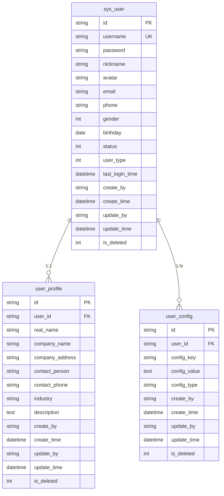
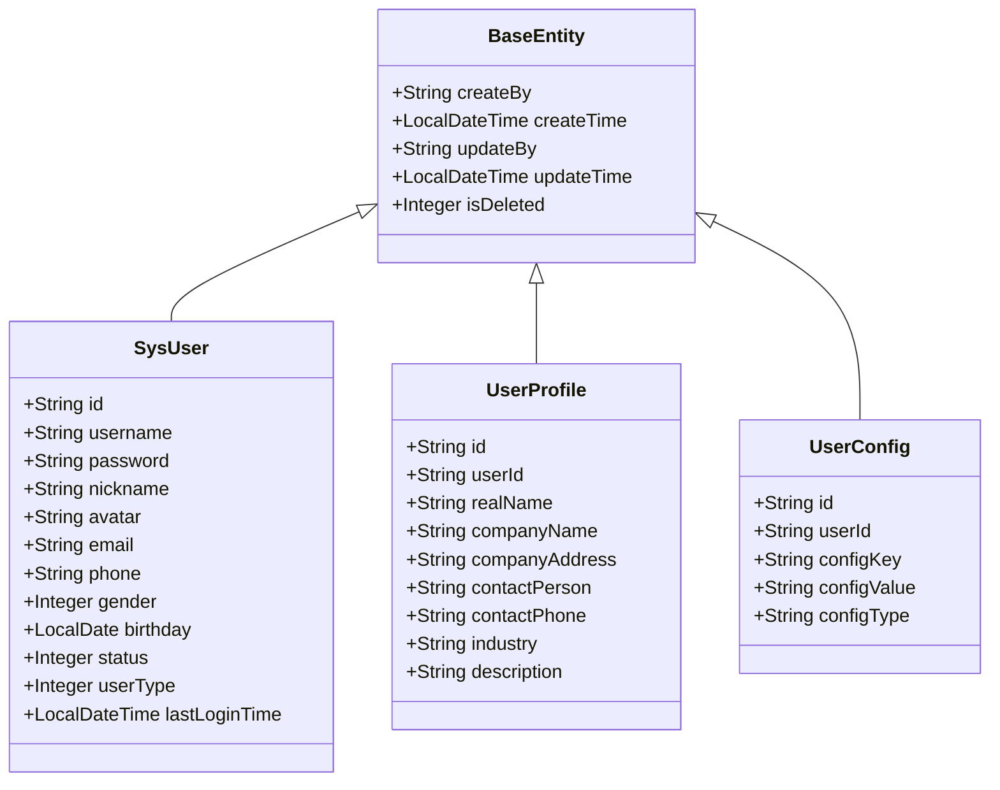
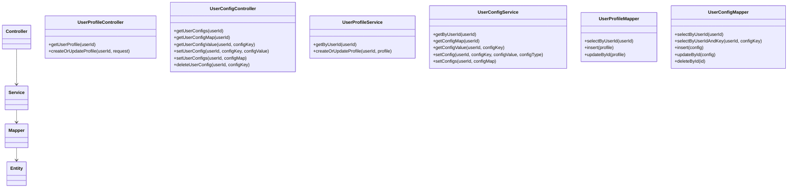
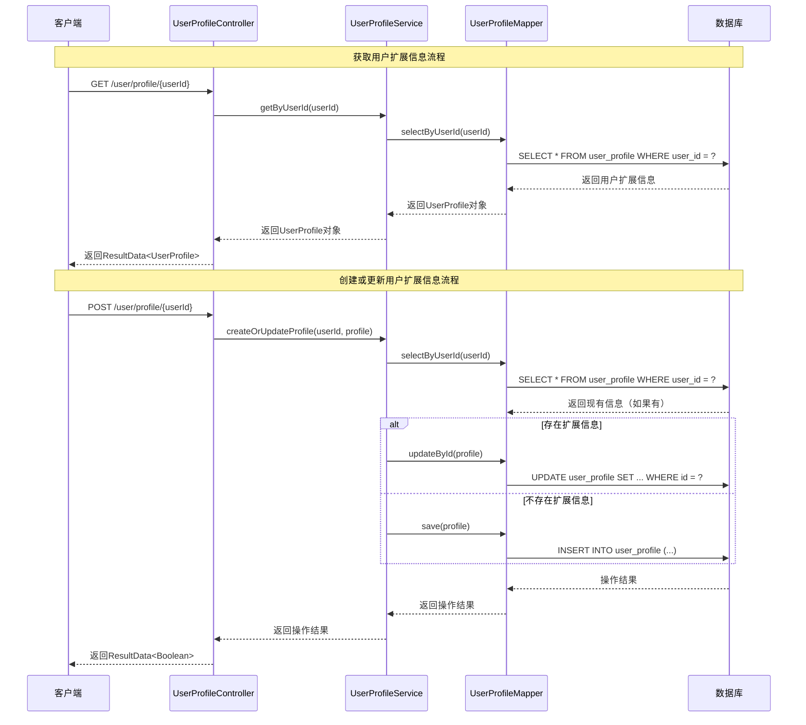
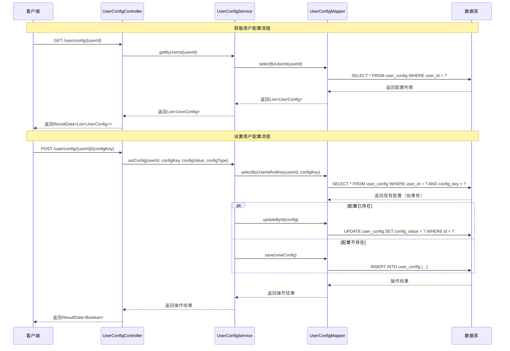
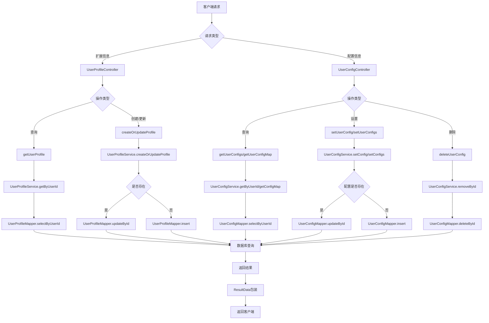
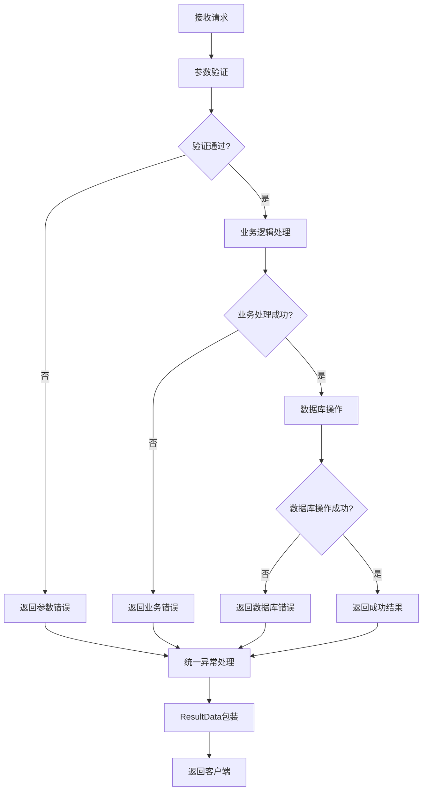

# 用户服务数据流向与流程图

## 概述
本文档描述service-user模块的数据流向、表关系、Java类映射关系以及业务流程。

## 数据表关系图

### 表结构关系

## Java类映射关系

### 实体类映射

### 分层架构映射

## 数据流向图

### 用户扩展信息管理流程

### 用户配置管理流程

## 业务流程图

### 用户信息管理整体流程

### 数据验证和错误处理流程

## 关键数据流转说明

### 1. 用户扩展信息流转
1. **查询流程**: 客户端 → Controller → Service → Mapper → 数据库 → 返回UserProfile对象
2. **更新流程**: 客户端 → Controller → Service → 检查是否存在 → 更新/创建 → 数据库操作

### 2. 用户配置流转
1. **查询流程**: 客户端 → Controller → Service → Mapper → 数据库 → 返回配置列表/Map
2. **设置流程**: 客户端 → Controller → Service → 检查配置是否存在 → 更新/创建 → 数据库操作

### 3. 数据一致性保证
- 使用事务管理确保数据一致性
- 逻辑删除保证数据完整性
- 公共字段自动填充（创建人、更新人等）

### 4. 性能优化
- 使用MyBatis-Plus的批量操作
- 配置缓存机制
- 数据库索引优化 