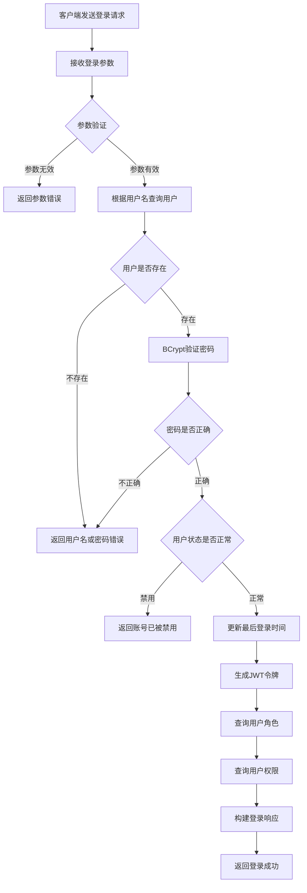
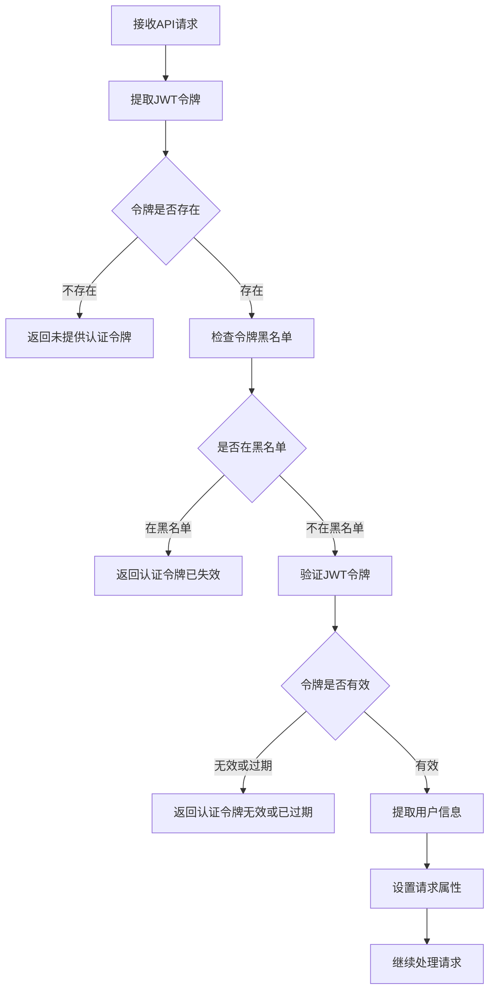
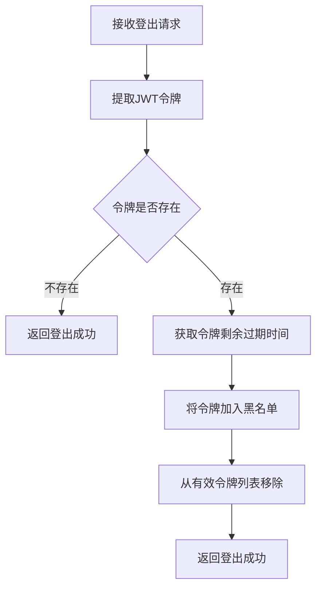
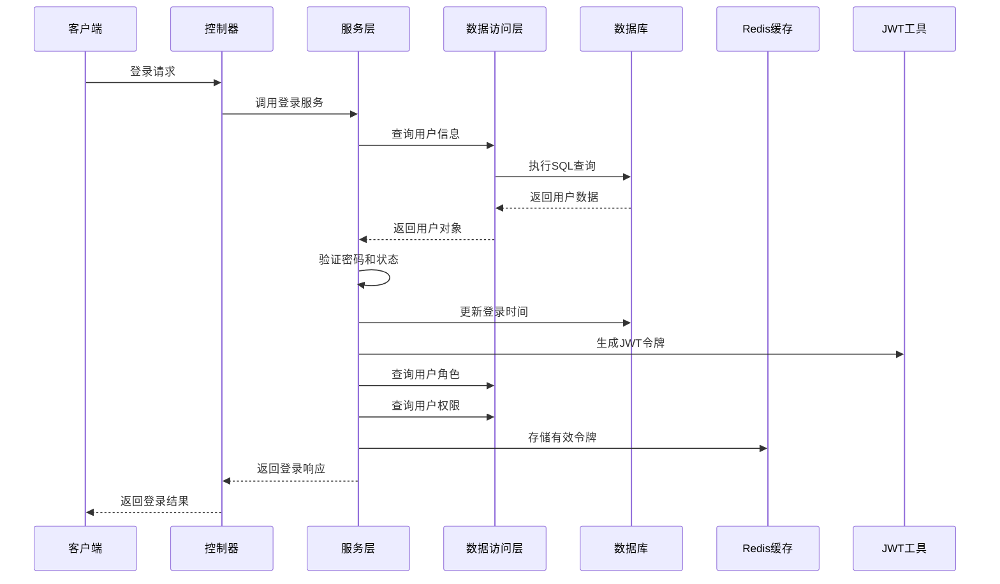
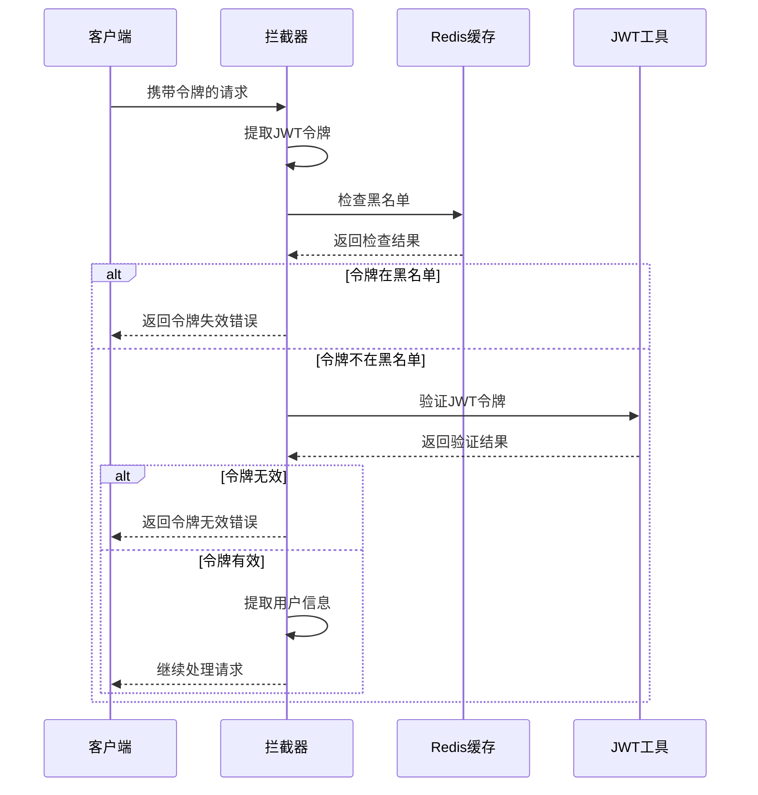
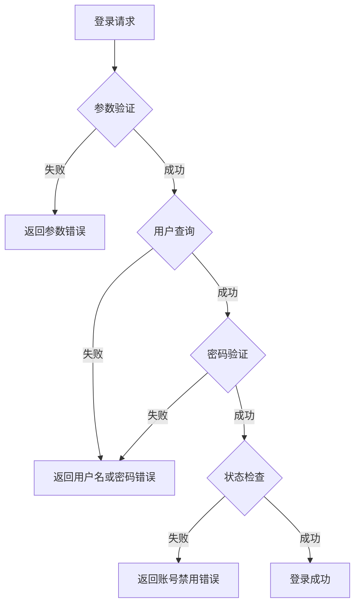
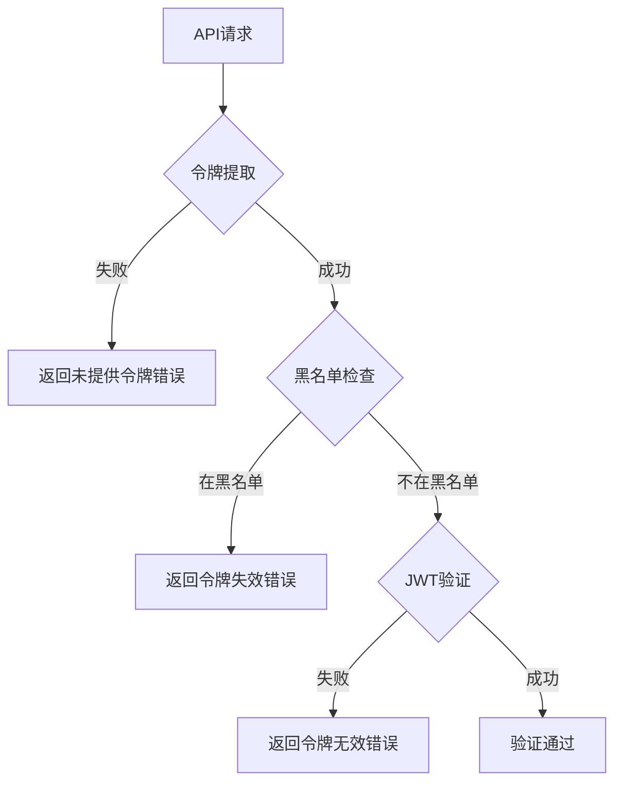

# 登录验证业务逻辑流程图

## 概述
本文档描述了半语积分商城项目的登录验证业务逻辑流程，包括登录、验证、登出等核心流程。

## 核心流程图

### 1. 用户登录流程



### 2. 请求验证流程



### 3. 用户登出流程



## 详细业务逻辑

### 1. 登录业务逻辑

#### 1.1 参数验证
```java
// 验证登录参数
if (StringUtils.isEmpty(loginRequest.getUsername()) || 
    StringUtils.isEmpty(loginRequest.getPassword())) {
    throw new BusinessException(ErrorCode.PARAM_ERROR, "用户名和密码不能为空");
}
```

#### 1.2 用户查询
```java
// 根据用户名查询用户
SysUser user = getByUsername(loginRequest.getUsername());
if (user == null) {
    throw new BusinessException(ErrorCode.PARAM_ERROR, "用户名或密码错误");
}
```

#### 1.3 密码验证
```java
// 使用BCrypt验证密码
if (!passwordEncoder.matches(loginRequest.getPassword(), user.getPassword())) {
    throw new BusinessException(ErrorCode.PARAM_ERROR, "用户名或密码错误");
}
```

#### 1.4 状态检查
```java
// 检查用户状态
if (user.getStatus() != 1) {
    throw new BusinessException(ErrorCode.FORBIDDEN, "账号已被禁用");
}
```

#### 1.5 JWT令牌生成
```java
// 生成JWT令牌
String token = JwtUtil.generateToken(String.valueOf(user.getId()), user.getUsername());

// 将令牌标记为有效并存储到Redis
TokenBlacklistUtil.markAsValid(token, jwtExpiration / 1000);
```

#### 1.6 权限查询
```java
// 查询用户角色
List<String> roles = sysRoleService.getRoleCodesByUserId(user.getId());

// 查询用户权限
List<String> permissions = sysPermissionService.getPermissionCodesByUserId(user.getId());
```

### 2. 请求验证业务逻辑

#### 2.1 令牌提取
```java
// 从请求头中获取token
String token = request.getHeader(tokenHeader);

// 如果请求头中没有token，则尝试从请求参数中获取
if (!StringUtils.hasText(token)) {
    token = request.getParameter("token");
}
```

#### 2.2 黑名单检查
```java
// 检查token是否在黑名单中
if (tokenBlacklistUtil.isBlacklisted(token)) {
    throw new BusinessException(ErrorCode.UNAUTHORIZED, "认证令牌已失效");
}
```

#### 2.3 JWT验证
```java
// 验证token是否有效
if (!jwtUtil.validateToken(token)) {
    throw new BusinessException(ErrorCode.UNAUTHORIZED, "认证令牌无效或已过期");
}
```

#### 2.4 用户信息设置
```java
// 从token中获取用户ID和用户名，并设置到请求属性中
String userId = jwtUtil.getUserIdFromToken(token);
String username = jwtUtil.getUsernameFromToken(token);

request.setAttribute("userId", userId);
request.setAttribute("username", username);
```

### 3. 登出业务逻辑

#### 3.1 令牌处理
```java
// 从请求头中获取token
String token = request.getHeader("Authorization");

if (StringUtils.hasText(token) && token.startsWith("Bearer ")) {
    token = token.substring(7);
    
    // 获取token的剩余过期时间
    long expirationTime = JwtUtil.getExpirationTime(token);
    if (expirationTime > 0) {
        TokenBlacklistUtil.addToBlacklist(token, expirationTime);
    }
    
    // 从有效token列表中移除
    TokenBlacklistUtil.removeFromValid(token);
}
```

## 数据流转图

### 1. 登录数据流转



### 2. 请求验证数据流转



## 错误处理流程

### 1. 登录错误处理



### 2. 认证错误处理



## 性能优化策略

### 1. 数据库优化
- 用户名唯一索引：`uk_username`
- 用户状态索引：`idx_status`
- 角色编码唯一索引：`uk_code`
- 权限编码唯一索引：`uk_code`

### 2. 缓存优化
- Redis缓存用户权限信息
- 令牌黑名单自动过期
- 有效令牌列表管理

### 3. 查询优化
- 一次性查询用户角色和权限
- 使用MyBatis-Plus优化查询
- 避免N+1查询问题

## 安全机制

### 1. 密码安全
- BCrypt加密存储
- 密码错误统一提示
- 防止用户枚举攻击

### 2. 令牌安全
- JWT签名验证
- 令牌过期时间控制
- 黑名单机制

### 3. 权限控制
- RBAC权限模型
- 细粒度权限控制
- 动态权限验证

## 版本历史
- 2025-07-30: 创建登录验证业务逻辑流程图文档 