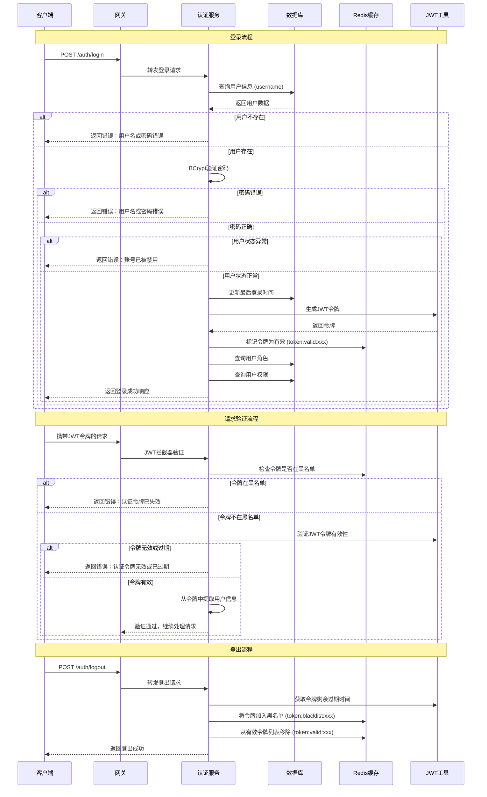

# 登录验证流程图设计文档

## 概述
本文档详细描述了半语积分商城项目的登录验证流程，包括数据库设计、认证流程、JWT令牌管理和安全机制。

## 数据库设计

### 1. 用户表 (sys_user)
```sql
CREATE TABLE `sys_user` (
  `id` varchar(32) NOT NULL COMMENT '用户ID',
  `username` varchar(50) NOT NULL COMMENT '用户名',
  `password` varchar(100) NOT NULL COMMENT '密码(BCrypt加密)',
  `nickname` varchar(50) DEFAULT NULL COMMENT '昵称',
  `avatar` varchar(255) DEFAULT NULL COMMENT '头像',
  `email` varchar(100) DEFAULT NULL COMMENT '邮箱',
  `phone` varchar(20) DEFAULT NULL COMMENT '手机号',
  `status` tinyint(1) DEFAULT 1 COMMENT '状态：0-禁用，1-正常',
  `create_time` datetime DEFAULT CURRENT_TIMESTAMP COMMENT '创建时间',
  `update_time` datetime DEFAULT CURRENT_TIMESTAMP ON UPDATE CURRENT_TIMESTAMP COMMENT '更新时间',
  `last_login_time` datetime DEFAULT NULL COMMENT '最后登录时间',
  `is_deleted` tinyint(1) DEFAULT 0 COMMENT '是否删除：0-未删除，1-已删除',
  PRIMARY KEY (`id`),
  UNIQUE KEY `uk_username` (`username`)
) ENGINE=InnoDB DEFAULT CHARSET=utf8mb4 COMMENT='系统用户表';
```

### 2. 角色表 (sys_role)
```sql
CREATE TABLE `sys_role` (
  `id` varchar(32) NOT NULL COMMENT '角色ID',
  `name` varchar(50) NOT NULL COMMENT '角色名称',
  `code` varchar(50) NOT NULL COMMENT '角色编码',
  `description` varchar(255) DEFAULT NULL COMMENT '角色描述',
  `status` tinyint(1) DEFAULT 1 COMMENT '状态：0-禁用，1-正常',
  `create_time` datetime DEFAULT CURRENT_TIMESTAMP COMMENT '创建时间',
  `update_time` datetime DEFAULT CURRENT_TIMESTAMP ON UPDATE CURRENT_TIMESTAMP COMMENT '更新时间',
  `is_deleted` tinyint(1) DEFAULT 0 COMMENT '是否删除：0-未删除，1-已删除',
  PRIMARY KEY (`id`),
  UNIQUE KEY `uk_code` (`code`)
) ENGINE=InnoDB DEFAULT CHARSET=utf8mb4 COMMENT='系统角色表';
```

### 3. 用户角色关联表 (sys_user_role)
```sql
CREATE TABLE `sys_user_role` (
  `id` varchar(32) NOT NULL COMMENT 'ID',
  `user_id` varchar(32) NOT NULL COMMENT '用户ID',
  `role_id` varchar(32) NOT NULL COMMENT '角色ID',
  PRIMARY KEY (`id`),
  KEY `idx_user_id` (`user_id`),
  KEY `idx_role_id` (`role_id`)
) ENGINE=InnoDB DEFAULT CHARSET=utf8mb4 COMMENT='用户角色关联表';
```

### 4. 权限表 (sys_permission)
```sql
CREATE TABLE `sys_permission` (
  `id` varchar(32) NOT NULL COMMENT '权限ID',
  `name` varchar(50) NOT NULL COMMENT '权限名称',
  `code` varchar(50) NOT NULL COMMENT '权限编码',
  `type` tinyint(1) NOT NULL COMMENT '权限类型：1-菜单，2-按钮，3-接口',
  `parent_id` varchar(32) DEFAULT NULL COMMENT '父权限ID',
  `path` varchar(255) DEFAULT NULL COMMENT '路径',
  `component` varchar(255) DEFAULT NULL COMMENT '组件',
  `icon` varchar(50) DEFAULT NULL COMMENT '图标',
  `sort` int DEFAULT 0 COMMENT '排序',
  `status` tinyint(1) DEFAULT 1 COMMENT '状态：0-禁用，1-正常',
  `create_time` datetime DEFAULT CURRENT_TIMESTAMP COMMENT '创建时间',
  `update_time` datetime DEFAULT CURRENT_TIMESTAMP ON UPDATE CURRENT_TIMESTAMP COMMENT '更新时间',
  `is_deleted` tinyint(1) DEFAULT 0 COMMENT '是否删除：0-未删除，1-已删除',
  PRIMARY KEY (`id`),
  UNIQUE KEY `uk_code` (`code`)
) ENGINE=InnoDB DEFAULT CHARSET=utf8mb4 COMMENT='系统权限表';
```

### 5. 角色权限关联表 (sys_role_permission)
```sql
CREATE TABLE `sys_role_permission` (
  `id` varchar(32) NOT NULL COMMENT 'ID',
  `role_id` varchar(32) NOT NULL COMMENT '角色ID',
  `permission_id` varchar(32) NOT NULL COMMENT '权限ID',
  PRIMARY KEY (`id`),
  KEY `idx_role_id` (`role_id`),
  KEY `idx_permission_id` (`permission_id`)
) ENGINE=InnoDB DEFAULT CHARSET=utf8mb4 COMMENT='角色权限关联表';
```

## 登录验证流程图



## 详细流程说明

### 1. 用户登录流程

#### 1.1 登录请求处理
1. **客户端发送登录请求**
   ```
   POST /auth/login
   Content-Type: application/json
   
   {
     "username": "admin",
     "password": "123456"
   }
   ```

2. **用户验证步骤**
   - 根据用户名查询用户信息
   - 使用BCrypt验证密码
   - 检查用户状态（是否被禁用）
   - 更新最后登录时间

3. **JWT令牌生成**
   - 生成包含用户ID和用户名的JWT令牌
   - 默认过期时间：1小时
   - 使用HS256算法签名

4. **权限信息查询**
   - 查询用户关联的角色
   - 查询角色关联的权限
   - 构建完整的用户权限信息

5. **登录响应**
   ```json
   {
     "code": 200,
     "msg": "登录成功",
     "data": {
       "userId": "1",
       "username": "admin",
       "nickname": "系统管理员",
       "avatar": null,
       "roles": ["ROLE_ADMIN"],
       "permissions": ["system:manage", "system:user:list"],
       "token": "Bearer eyJhbGciOiJIUzI1NiJ9...",
       "tokenType": "Bearer",
       "expiresIn": 3600
     }
   }
   ```

### 2. 请求验证流程

#### 2.1 JWT拦截器验证
1. **令牌提取**
   - 从请求头 `Authorization` 中提取令牌
   - 支持从请求参数 `token` 中提取令牌
   - 去除 `Bearer ` 前缀

2. **黑名单检查**
   - 检查令牌是否在Redis黑名单中
   - 黑名单键格式：`token:blacklist:{token}`
   - 如果在黑名单中，直接拒绝请求

3. **JWT有效性验证**
   - 验证JWT签名是否正确
   - 检查令牌是否过期
   - 解析令牌中的用户信息

4. **用户信息设置**
   - 将用户ID和用户名设置到请求属性中
   - 供后续业务逻辑使用

### 3. 用户登出流程

#### 3.1 登出处理
1. **令牌获取**
   - 从请求头中提取JWT令牌
   - 去除 `Bearer ` 前缀

2. **黑名单管理**
   - 获取令牌的剩余过期时间
   - 将令牌加入Redis黑名单
   - 从有效令牌列表中移除

3. **登出响应**
   ```json
   {
     "code": 200,
     "msg": "登出成功"
   }
   ```

## 安全机制

### 1. 密码安全
- 使用BCrypt算法加密存储密码
- 支持密码强度验证
- 密码错误时统一提示，避免用户枚举

### 2. JWT令牌安全
- 使用强密钥签名
- 设置合理的过期时间
- 支持令牌黑名单机制

### 3. Redis缓存安全
- 令牌黑名单：`token:blacklist:{token}`
- 有效令牌：`token:valid:{token}`
- 自动过期清理

### 4. 数据库安全
- 用户状态控制
- 软删除机制
- 唯一索引约束

## 错误处理

### 1. 登录错误
- `PARAM_ERROR(400)`: 用户名或密码错误
- `FORBIDDEN(403)`: 账号已被禁用

### 2. 认证错误
- `UNAUTHORIZED(401)`: 未提供认证令牌
- `UNAUTHORIZED(401)`: 认证令牌已失效
- `UNAUTHORIZED(401)`: 认证令牌无效或已过期

## 性能优化

### 1. 数据库优化
- 用户名唯一索引
- 用户角色关联表索引
- 角色权限关联表索引

### 2. 缓存优化
- Redis缓存用户权限信息
- 令牌黑名单自动过期
- 有效令牌列表管理

### 3. 查询优化
- 一次性查询用户角色和权限
- 使用MyBatis-Plus优化查询
- 避免N+1查询问题

## 扩展性设计

### 1. 多端支持
- 支持Web端、移动端、小程序
- 统一的认证接口
- 灵活的权限控制

### 2. 第三方登录
- 预留第三方登录接口
- 支持OAuth2.0协议
- 可扩展的认证策略

### 3. 权限扩展
- 支持RBAC权限模型
- 支持动态权限配置
- 支持权限继承

## 监控和日志

### 1. 登录监控
- 记录登录成功/失败日志
- 监控异常登录行为
- 统计登录频率

### 2. 令牌监控
- 监控令牌生成和验证
- 记录令牌黑名单操作
- 统计令牌使用情况

### 3. 性能监控
- 监控认证接口响应时间
- 监控数据库查询性能
- 监控Redis缓存命中率

## 版本历史
- 2025-07-30: 创建登录验证流程图设计文档
- 2025-07-30: 完善数据库设计和安全机制说明 