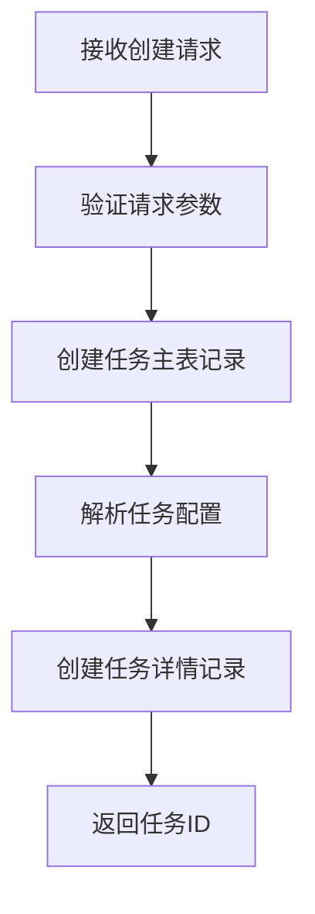
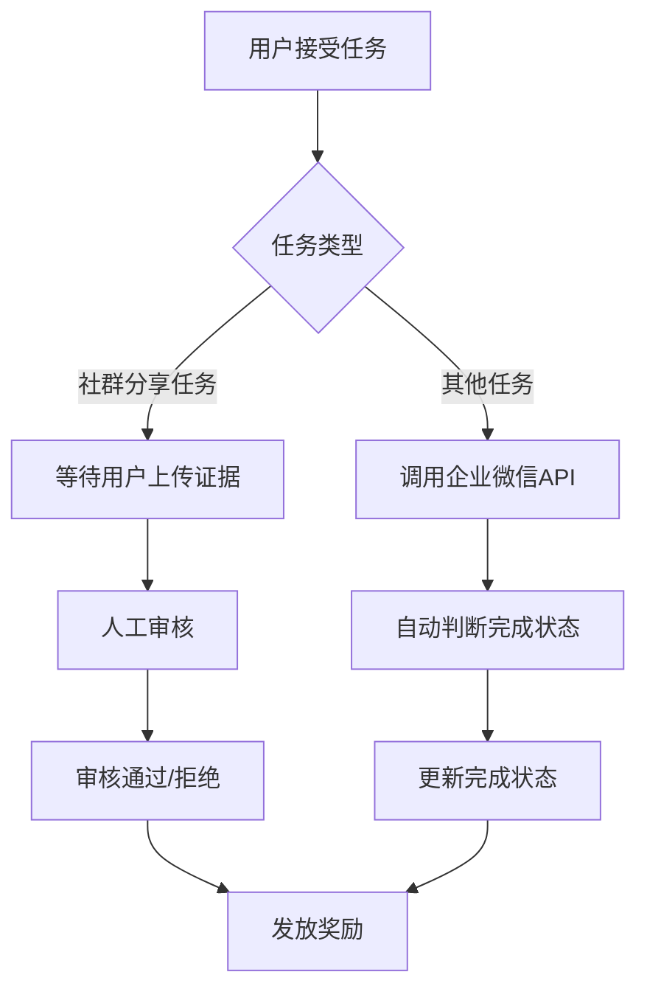

# 发布者模块设计文档

> **文档位置**: `zinfra/moudleDocs/core-publisher/模块设计.md`
> **创建时间**: 2025-01-27
> **作者**: scccy

## ⚠️ 核心注意事项

> **重要提醒**: 发布者模块是banyuMall系统的核心业务模块，负责管理七种不同类型的任务发布、配置和审核流程。

### 关键约束
- [x] **任务类型约束**: 支持7种固定任务类型，新增任务类型需要修改代码
- [x] **完成判断约束**: 除社群分享任务外，其他任务通过企业微信API自动判断
- [x] **JSON配置约束**: 任务特定配置使用JSON存储，需要应用层验证
- [x] **审核流程约束**: 社群分享任务必须经过人工审核才能发放奖励

### 特殊要求
- [x] **企业微信集成**: 需要集成企业微信API进行任务完成状态判断
- [x] **图片上传**: 社群分享任务支持图片上传和截图验证
- [x] **邀请类型**: 邀请任务支持两种类型（邀请加好友和邀请入群）
- [x] **完成统计**: 任务列表需要显示完成人数统计

### 风险提示
- [x] **API依赖风险**: 企业微信API不可用时影响任务完成判断
- [x] **JSON解析风险**: JSON配置解析错误可能导致任务配置异常
- [x] **审核效率风险**: 人工审核可能成为性能瓶颈
- [x] **数据一致性风险**: 主表与JSON配置数据需要保持一致性

### 依赖关系
- [x] **企业微信模块**: 依赖企业微信API进行任务完成判断
- [x] **用户模块**: 依赖用户信息进行任务分配和奖励发放
- [x] **OSS模块**: 依赖对象存储服务进行图片上传
- [x] **认证模块**: 依赖JWT认证进行接口权限控制

---

## 1. 模块概述

### 1.1 模块职责
发布者模块负责管理七种不同类型的任务发布、配置和审核流程，包括任务创建、状态管理、完成判断和奖励发放等核心功能。

### 1.2 模块边界
- **输入边界**: 任务创建请求、任务完成提交、审核操作
- **输出边界**: 任务列表、任务详情、完成统计、审核结果
- **外部依赖**: 企业微信API、用户服务、OSS服务、认证服务

### 1.3 技术栈
- **框架**: Spring Boot 3.x
- **数据库**: MySQL 8.0
- **ORM**: MyBatis-Plus
- **JSON处理**: FastJSON2
- **服务发现**: Nacos
- **负载均衡**: Spring Cloud LoadBalancer
- **微服务通信**: OpenFeign

## 2. 架构设计

### 2.1 整体架构
```
┌─────────────────┐    ┌─────────────────┐    ┌─────────────────┐
│   前端应用      │    │   移动应用      │    │   管理后台      │
└─────────┬───────┘    └─────────┬───────┘    └─────────┬───────┘
          │                      │                      │
          └──────────────────────┼──────────────────────┘
                                 │
                    ┌─────────────┴─────────────┐
                    │      API网关              │
                    └─────────────┬─────────────┘
                                 │
                    ┌─────────────┴─────────────┐
                    │   发布者模块              │
                    │  (core-publisher)         │
                    └─────────────┬─────────────┘
                                 │
          ┌──────────────────────┼──────────────────────┐
          │                      │                      │
┌─────────┴───────┐    ┌─────────┴───────┐    ┌─────────┴───────┐
│   企业微信API   │    │   用户服务      │    │   OSS服务       │
└─────────────────┘    └─────────────────┘    └─────────────────┘
```

### 2.2 包结构设计
```
src/main/java/com/origin/publisher/
├── config/                    # 配置类
│   ├── MyBatisPlusConfig.java
│   └── WebConfig.java
├── controller/                # 控制器
│   ├── PublisherTaskController.java
│   └── PublisherShareReviewController.java
├── dto/                      # 数据传输对象
│   ├── TaskCreateRequest.java
│   ├── TaskUpdateRequest.java
│   ├── TaskListResponse.java
│   └── TaskDetailResponse.java
├── entity/                   # 实体类
│   ├── PublisherTask.java
│   ├── PublisherTaskDetail.java
│   ├── PublisherShareReview.java
│   └── PublisherTaskCompletion.java
├── exception/                # 异常处理
│   ├── TaskNotFoundException.java
│   └── TaskValidationException.java
├── feign/                    # Feign客户端
│   ├── WechatWorkFeignClient.java
│   └── UserFeignClient.java
├── mapper/                   # MyBatis映射器
│   ├── PublisherTaskMapper.java
│   ├── PublisherTaskDetailMapper.java
│   ├── PublisherShareReviewMapper.java
│   └── PublisherTaskCompletionMapper.java
├── service/                  # 服务层
│   ├── PublisherTaskService.java
│   ├── PublisherTaskServiceImpl.java
│   ├── TaskCompletionService.java
│   └── WechatWorkIntegrationService.java
├── util/                     # 工具类
│   ├── TaskConfigParser.java
│   └── TaskValidator.java
└── CorePublisherApplication.java
```

### 2.3 类设计

#### 2.3.1 核心实体类
```java
// 任务主表实体
@Data
@TableName("publisher_task")
public class PublisherTask extends BaseEntity {
    @TableId
    private String taskId;                    // 任务ID
    private String taskName;                  // 任务名称
    private Integer taskTypeId;               // 任务类型ID
    private String taskDescription;           // 任务描述
    private BigDecimal taskReward;            // 任务积分
    private String taskIconUrl;               // 任务图标URL
    private String detailId;                  // 详情配置ID
    private Integer statusId;                 // 任务状态ID
}

// 任务详情表实体
@Data
@TableName("publisher_task_detail")
public class PublisherTaskDetail extends BaseEntity {
    @TableId
    private String detailId;                  // 详情ID
    private String taskId;                    // 任务ID
    private String taskConfig;                // 任务配置JSON
}

// 任务完成流水表实体
@Data
@TableName("publisher_task_completion")
public class PublisherTaskCompletion extends BaseEntity {
    @TableId
    private String completionId;              // 完成记录ID
    private String taskId;                    // 任务ID
    private String userId;                    // 完成用户ID
    private Integer completionStatus;         // 完成状态
    private LocalDateTime completionTime;     // 完成时间
    private BigDecimal rewardAmount;          // 获得奖励金额
    private String completionEvidence;        // 完成证据JSON
}
```

#### 2.3.2 核心服务类
```java
// 任务管理服务
@Service
public interface PublisherTaskService {
    // 任务CRUD操作
    String createTask(TaskCreateRequest request);
    void updateTask(String taskId, TaskUpdateRequest request);
    TaskDetailResponse getTaskDetail(String taskId);
    PageResult<TaskListResponse> getTaskList(TaskListRequest request);
    void deleteTask(String taskId);
    
    // 任务状态管理
    void updateTaskStatus(String taskId, Integer statusId);
    void publishTask(String taskId);
    void unpublishTask(String taskId);
}

// 任务完成服务
@Service
public interface TaskCompletionService {
    // 任务完成管理
    void acceptTask(String taskId, String userId);
    void submitTaskCompletion(String taskId, String userId, String evidence);
    void reviewTaskCompletion(String completionId, Integer reviewStatus, String comment);
    
    // 自动判断任务完成
    void checkTaskCompletion(String taskId, String userId);
    void processWechatWorkCallback(String taskId, String userId, String status);
}
```

## 3. 数据设计

### 3.1 数据库设计

#### 3.1.1 表结构概览
| 表名 | 用途 | 主要字段 | 记录数预估 |
|------|------|----------|------------|
| `publisher_task` | 任务主表 | `task_id`, `task_name`, `task_type_id`, `status_id` | 10万+ |
| `publisher_task_detail` | 任务详情表 | `detail_id`, `task_id`, `task_config` (JSON) | 10万+ |
| `publisher_share_review` | 社群分享审核 | `share_review_id`, `task_id`, `share_content` | 5万+ |
| `publisher_task_completion` | 任务完成流水表 | `completion_id`, `task_id`, `user_id`, `completion_evidence` | 100万+ |

#### 3.1.2 核心表设计
```sql
-- 任务主表
CREATE TABLE `publisher_task` (
    `task_id` VARCHAR(32) NOT NULL COMMENT '任务ID',
    `task_name` VARCHAR(100) NOT NULL COMMENT '任务名称',
    `task_type_id` INT NOT NULL COMMENT '任务类型ID：1-点赞，2-评论，3-讨论，4-分享，5-邀请，6-反馈，7-排行榜',
    `task_description` TEXT COMMENT '任务描述',
    `task_reward` DECIMAL(10,2) NOT NULL DEFAULT 0.00 COMMENT '任务积分',
    `task_icon_url` VARCHAR(500) DEFAULT NULL COMMENT '任务图标URL',
    `detail_id` VARCHAR(32) DEFAULT NULL COMMENT '详情配置ID',
    `status_id` INT NOT NULL DEFAULT 1 COMMENT '任务状态ID：1-草稿，2-上架，3-下架，4-审核通过，5-审核不通过',
    -- 通用字段
    `created_time` DATETIME NOT NULL DEFAULT CURRENT_TIMESTAMP,
    `updated_time` DATETIME NOT NULL DEFAULT CURRENT_TIMESTAMP ON UPDATE CURRENT_TIMESTAMP,
    `created_by` VARCHAR(32) DEFAULT NULL,
    `updated_by` VARCHAR(32) DEFAULT NULL,
    `deleted` TINYINT(1) NOT NULL DEFAULT 0,
    PRIMARY KEY (`task_id`),
    KEY `idx_task_type_id` (`task_type_id`),
    KEY `idx_status_id` (`status_id`),
    KEY `idx_detail_id` (`detail_id`),
    KEY `idx_created_time` (`created_time`),
    KEY `idx_type_status` (`task_type_id`, `status_id`)
) ENGINE=InnoDB DEFAULT CHARSET=utf8mb4 COLLATE=utf8mb4_0900_bin COMMENT='任务主表';

-- 任务详情表
CREATE TABLE `publisher_task_detail` (
    `detail_id` VARCHAR(32) NOT NULL COMMENT '详情ID',
    `task_id` VARCHAR(32) NOT NULL COMMENT '任务ID',
    `task_config` JSON NOT NULL COMMENT '任务配置JSON',
    -- 通用字段
    `created_time` DATETIME NOT NULL DEFAULT CURRENT_TIMESTAMP,
    `updated_time` DATETIME NOT NULL DEFAULT CURRENT_TIMESTAMP ON UPDATE CURRENT_TIMESTAMP,
    `created_by` VARCHAR(32) DEFAULT NULL,
    `updated_by` VARCHAR(32) DEFAULT NULL,
    `deleted` TINYINT(1) NOT NULL DEFAULT 0,
    PRIMARY KEY (`detail_id`),
    UNIQUE KEY `uk_task_id` (`task_id`),
    KEY `idx_task_id` (`task_id`)
) ENGINE=InnoDB DEFAULT CHARSET=utf8mb4 COLLATE=utf8mb4_0900_bin COMMENT='任务详情表';

-- 任务完成流水表
CREATE TABLE `publisher_task_completion` (
    `completion_id` VARCHAR(32) NOT NULL COMMENT '完成记录ID',
    `task_id` VARCHAR(32) NOT NULL COMMENT '任务ID',
    `user_id` VARCHAR(32) NOT NULL COMMENT '完成用户ID',
    `completion_status` INT NOT NULL DEFAULT 1 COMMENT '完成状态：1-进行中，2-已完成，3-已拒绝',
    `completion_time` DATETIME COMMENT '完成时间',
    `reward_amount` DECIMAL(10,2) NOT NULL DEFAULT 0.00 COMMENT '获得奖励金额',
    `completion_evidence` JSON COMMENT '完成证据（仅社群分享任务需要，其他任务通过企业微信API自动判断）',
    -- 通用字段
    `created_time` DATETIME NOT NULL DEFAULT CURRENT_TIMESTAMP,
    `updated_time` DATETIME NOT NULL DEFAULT CURRENT_TIMESTAMP ON UPDATE CURRENT_TIMESTAMP,
    `created_by` VARCHAR(32) DEFAULT NULL,
    `updated_by` VARCHAR(32) DEFAULT NULL,
    `deleted` TINYINT(1) NOT NULL DEFAULT 0,
    PRIMARY KEY (`completion_id`),
    KEY `idx_task_id` (`task_id`),
    KEY `idx_user_id` (`user_id`),
    KEY `idx_completion_status` (`completion_status`),
    KEY `idx_completion_time` (`completion_time`),
    KEY `idx_task_user` (`task_id`, `user_id`),
    KEY `idx_user_status` (`user_id`, `completion_status`)
) ENGINE=InnoDB DEFAULT CHARSET=utf8mb4 COLLATE=utf8mb4_0900_bin COMMENT='任务完成流水表';
```

### 3.2 实体设计

#### 3.2.1 数据传输对象
```java
// 任务创建请求
@Data
public class TaskCreateRequest {
    @NotBlank(message = "任务名称不能为空")
    private String taskName;                  // 任务名称
    
    @NotNull(message = "任务类型不能为空")
    private Integer taskTypeId;               // 任务类型ID
    
    private String taskDescription;           // 任务描述
    
    @NotNull(message = "任务积分不能为空")
    @DecimalMin(value = "0.01", message = "任务积分必须大于0")
    private BigDecimal taskReward;            // 任务积分
    
    private String taskIconUrl;               // 任务图标URL
    
    // 特定任务类型的配置字段
    private Map<String, Object> taskConfig;   // 任务特定配置
}

// 任务列表响应
@Data
public class TaskListResponse {
    private String taskId;                    // 任务ID
    private String taskName;                  // 任务名称
    private Integer taskTypeId;               // 任务类型ID
    private String taskDescription;           // 任务描述
    private BigDecimal taskReward;            // 任务积分
    private String taskIconUrl;               // 任务图标URL
    private Integer statusId;                 // 任务状态ID
    private LocalDateTime createdTime;        // 创建时间
    private Integer completionCount;          // 完成人数统计
    private Map<String, Object> taskConfig;   // 任务特定配置
}

// 任务详情响应
@Data
public class TaskDetailResponse {
    private String taskId;                    // 任务ID
    private String taskName;                  // 任务名称
    private Integer taskTypeId;               // 任务类型ID
    private String taskDescription;           // 任务描述
    private BigDecimal taskReward;            // 任务积分
    private String taskIconUrl;               // 任务图标URL
    private Integer statusId;                 // 任务状态ID
    private LocalDateTime createdTime;        // 创建时间
    private LocalDateTime updatedTime;        // 更新时间
    private Integer completionCount;          // 完成人数统计
    private Map<String, Object> taskConfig;   // 任务特定配置
}
```

## 4. 接口设计

### 4.1 接口规范
- **Content-Type**: application/json
- **认证方式**: JWT Token (Bearer)
- **字符编码**: UTF-8
- **响应格式**: 统一响应格式

### 4.2 接口列表

#### 4.2.1 任务管理接口
| 序号 | 接口名称 | 请求方法 | 接口路径 | 功能描述 | Feign客户端 | 详细说明 |
|------|----------|----------|----------|----------|-------------|----------|
| 1 | 创建任务 | POST | /core/publisher/tasks | 创建新任务 | 否 | [查看详情](#41-创建任务) |
| 2 | 更新任务 | PUT | /core/publisher/tasks/{taskId} | 更新任务信息 | 否 | [查看详情](#42-更新任务) |
| 3 | 获取任务详情 | GET | /core/publisher/tasks/{taskId} | 获取任务详细信息 | 否 | [查看详情](#43-获取任务详情) |
| 4 | 获取任务列表 | GET | /core/publisher/tasks | 获取任务列表（包含完成人数统计） | 否 | [查看详情](#44-获取任务列表) |
| 5 | 删除任务 | DELETE | /core/publisher/tasks/{taskId} | 删除任务 | 否 | [查看详情](#45-删除任务) |

#### 4.2.2 任务状态管理接口
| 序号 | 接口名称 | 请求方法 | 接口路径 | 功能描述 | Feign客户端 | 详细说明 |
|------|----------|----------|----------|----------|-------------|----------|
| 6 | 更新任务状态 | PUT | /core/publisher/tasks/{taskId}/status | 更新任务状态 | 否 | [查看详情](#46-更新任务状态) |
| 7 | 发布任务 | POST | /core/publisher/tasks/{taskId}/publish | 发布任务 | 否 | [查看详情](#47-发布任务) |
| 8 | 下架任务 | POST | /core/publisher/tasks/{taskId}/unpublish | 下架任务 | 否 | [查看详情](#48-下架任务) |

#### 4.2.3 任务完成管理接口
| 序号 | 接口名称 | 请求方法 | 接口路径 | 功能描述 | Feign客户端 | 详细说明 |
|------|----------|----------|----------|----------|-------------|----------|
| 9 | 提交任务完成 | POST | /core/publisher/tasks/{taskId}/complete | 提交任务完成 | 否 | [查看详情](#49-提交任务完成) |
| 10 | 获取任务完成列表 | GET | /core/publisher/tasks/{taskId}/completions | 获取任务完成列表 | 否 | [查看详情](#410-获取任务完成列表) |
| 11 | 审核任务完成 | PUT | /core/publisher/completions/{completionId}/review | 审核任务完成 | 否 | [查看详情](#411-审核任务完成) |

### 4.3 接口详情

#### 4.3.1 创建任务
**接口路径**: `POST /core/publisher/tasks`

**功能描述**: 创建新任务

**Feign客户端**: 否

**请求参数**:
```json
{
  "taskName": "点赞任务",
  "taskTypeId": 1,
  "taskDescription": "为指定内容点赞",
  "taskReward": 10.00,
  "taskIconUrl": "https://example.com/icon.png",
  "taskConfig": {}
}
```

**响应参数**:
```json
{
  "code": 200,
  "message": "success",
  "data": {
    "taskId": "TASK_123456789"
  }
}
```

#### 4.3.2 更新任务
**接口路径**: `PUT /core/publisher/tasks/{taskId}`

**功能描述**: 更新任务信息

**Feign客户端**: 否

**请求参数**:
```json
{
  "taskName": "更新后的任务名称",
  "taskDescription": "更新后的任务描述",
  "taskReward": 15.00,
  "taskIconUrl": "https://example.com/new-icon.png",
  "taskConfig": {}
}
```

**响应参数**:
```json
{
  "code": 200,
  "message": "success",
  "data": null
}
```

#### 4.3.3 获取任务详情
**接口路径**: `GET /core/publisher/tasks/{taskId}`

**功能描述**: 获取任务详细信息

**Feign客户端**: 否

**请求参数**: 无

**响应参数**:
```json
{
  "code": 200,
  "message": "success",
  "data": {
    "taskId": "TASK_123456789",
    "taskName": "点赞任务",
    "taskTypeId": 1,
    "taskDescription": "为指定内容点赞",
    "taskReward": 10.00,
    "taskIconUrl": "https://example.com/icon.png",
    "statusId": 2,
    "createdTime": "2025-01-27T10:00:00",
    "updatedTime": "2025-01-27T10:00:00",
    "completionCount": 25,
    "taskConfig": {}
  }
}
```

#### 4.3.4 获取任务列表
**接口路径**: `GET /core/publisher/tasks`

**功能描述**: 获取任务列表（包含完成人数统计）

**Feign客户端**: 否

**请求参数**:
| 参数名 | 类型 | 必填 | 说明 |
|--------|------|------|------|
| page | Integer | 否 | 页码，默认1 |
| size | Integer | 否 | 每页大小，默认10 |
| taskTypeId | Integer | 否 | 任务类型ID过滤 |
| statusId | Integer | 否 | 任务状态ID过滤 |
| keyword | String | 否 | 任务名称关键词搜索 |

**响应参数**:
```json
{
  "code": 200,
  "message": "success",
  "data": {
    "total": 100,
    "pages": 10,
    "current": 1,
    "size": 10,
    "records": [
      {
        "taskId": "TASK_123456789",
        "taskName": "点赞任务",
        "taskTypeId": 1,
        "taskDescription": "为指定内容点赞",
        "taskReward": 10.00,
        "taskIconUrl": "https://example.com/icon.png",
        "statusId": 2,
        "createdTime": "2025-01-27T10:00:00",
        "completionCount": 25,
        "taskConfig": {}
      }
    ]
  }
}
```

**完成人数统计实现**:
```java
// 在TaskListResponse中添加完成人数字段
@Data
public class TaskListResponse {
    // ... 其他字段
    private Integer completionCount;          // 完成人数统计
}

// 在Service层实现统计逻辑
@Service
public class PublisherTaskServiceImpl implements PublisherTaskService {
    
    @Override
    public PageResult<TaskListResponse> getTaskList(TaskListRequest request) {
        // 1. 查询任务列表
        Page<PublisherTask> taskPage = taskMapper.selectPage(
            new Page<>(request.getPage(), request.getSize()),
            buildQueryWrapper(request)
        );
        
        // 2. 转换为响应对象
        List<TaskListResponse> responses = taskPage.getRecords().stream()
            .map(this::convertToTaskListResponse)
            .collect(Collectors.toList());
        
        // 3. 批量查询完成人数统计
        List<String> taskIds = responses.stream()
            .map(TaskListResponse::getTaskId)
            .collect(Collectors.toList());
        
        Map<String, Integer> completionCountMap = taskCompletionMapper.selectCompletionCountByTaskIds(taskIds);
        
        // 4. 设置完成人数
        responses.forEach(response -> 
            response.setCompletionCount(completionCountMap.getOrDefault(response.getTaskId(), 0))
        );
        
        return new PageResult<>(responses, taskPage.getTotal(), taskPage.getCurrent(), taskPage.getSize());
    }
    
    private TaskListResponse convertToTaskListResponse(PublisherTask task) {
        TaskListResponse response = new TaskListResponse();
        BeanUtils.copyProperties(task, response);
        
        // 查询任务配置
        PublisherTaskDetail detail = taskDetailMapper.selectByTaskId(task.getTaskId());
        if (detail != null) {
            response.setTaskConfig(JSON.parseObject(detail.getTaskConfig(), Map.class));
        }
        
        return response;
    }
}

// 在Mapper中添加统计方法
@Mapper
public interface PublisherTaskCompletionMapper extends BaseMapper<PublisherTaskCompletion> {
    
    @Select("SELECT task_id, COUNT(*) as completion_count " +
            "FROM publisher_task_completion " +
            "WHERE task_id IN (${taskIds}) " +
            "AND completion_status = 2 " +  // 已完成状态
            "AND deleted = 0 " +
            "GROUP BY task_id")
    Map<String, Integer> selectCompletionCountByTaskIds(@Param("taskIds") List<String> taskIds);
}
```

## 5. 业务逻辑

### 5.1 核心业务流程

#### 5.1.1 任务创建流程


#### 5.1.2 任务完成判断流程


### 5.2 业务规则

#### 5.2.1 任务状态流转规则
- **草稿** → **上架**: 任务配置完整且通过验证
- **上架** → **下架**: 管理员操作或任务过期
- **下架** → **上架**: 重新发布任务
- **上架** → **审核通过**: 任务审核通过
- **上架** → **审核不通过**: 任务审核不通过

#### 5.2.2 任务完成规则
- **自动判断任务**: 通过企业微信API查询完成状态
- **人工审核任务**: 用户上传证据，审核员审核
- **奖励发放**: 任务完成后自动发放奖励

#### 5.2.3 数据验证规则
- 任务名称不能为空且长度不超过100字符
- 任务积分必须大于0
- 任务类型必须是预定义的7种类型之一
- JSON配置必须符合对应任务类型的格式要求

### 5.3 异常处理

#### 5.3.1 业务异常
```java
// 任务不存在异常
public class TaskNotFoundException extends BusinessException {
    public TaskNotFoundException(String taskId) {
        super("任务不存在: " + taskId);
    }
}

// 任务状态异常
public class TaskStatusException extends BusinessException {
    public TaskStatusException(String message) {
        super("任务状态异常: " + message);
    }
}

// 任务配置验证异常
public class TaskConfigValidationException extends BusinessException {
    public TaskConfigValidationException(String message) {
        super("任务配置验证失败: " + message);
    }
}
```

#### 5.3.2 异常处理策略
- **参数验证异常**: 返回400错误，提示具体错误信息
- **业务逻辑异常**: 返回400错误，提示业务规则违反
- **系统异常**: 返回500错误，记录详细日志
- **外部服务异常**: 返回503错误，提示服务暂时不可用

## 6. 安全设计

### 6.1 认证授权
- **JWT认证**: 所有接口需要有效的JWT Token
- **角色权限**: 基于角色的访问控制
- **操作审计**: 记录所有关键操作的审计日志

### 6.2 数据安全
- **敏感信息脱敏**: 用户ID等敏感信息进行脱敏处理
- **数据加密**: 重要配置信息进行加密存储
- **访问控制**: 限制数据访问权限

### 6.3 接口安全
- **参数验证**: 严格的参数验证和过滤
- **SQL注入防护**: 使用MyBatis-Plus防止SQL注入
- **XSS防护**: 输入输出进行XSS过滤

## 7. 性能设计

### 7.1 性能指标
- **响应时间**: 接口响应时间 < 200ms
- **吞吐量**: 支持1000 QPS
- **并发数**: 支持1000并发用户
- **可用性**: 99.9%可用性

### 7.2 优化策略
- **数据库优化**: 合理设计索引，优化SQL查询
- **缓存策略**: 使用Redis缓存热点数据
- **分页查询**: 大数据量使用分页查询
- **异步处理**: 非关键操作使用异步处理

### 7.3 监控方案
- **性能监控**: 监控接口响应时间和吞吐量
- **错误监控**: 监控错误率和异常情况
- **资源监控**: 监控CPU、内存、磁盘使用情况
- **业务监控**: 监控任务完成率、审核效率等业务指标

## 8. 总结

发布者模块采用现代化的微服务架构设计，通过JSON配置实现任务类型的灵活扩展，通过企业微信API集成实现任务完成的自动判断，通过人工审核机制确保社群分享任务的质量。整个设计既保证了系统的稳定性和可扩展性，又满足了复杂的业务需求。

### 8.1 设计亮点
- **灵活的任务配置**: 通过JSON配置支持不同类型任务的特定需求
- **智能的完成判断**: 自动判断与人工审核相结合
- **完善的统计功能**: 任务列表包含完成人数统计
- **规范的接口设计**: 遵循RESTful API设计规范
- **安全的系统架构**: 多层次的安全防护机制

### 8.2 技术优势
- **高性能**: 优化的数据库设计和缓存策略
- **高可用**: 微服务架构和负载均衡
- **易扩展**: 模块化设计和标准化接口
- **易维护**: 清晰的代码结构和完善的文档 